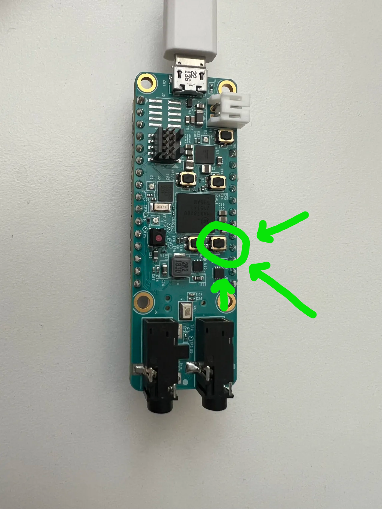
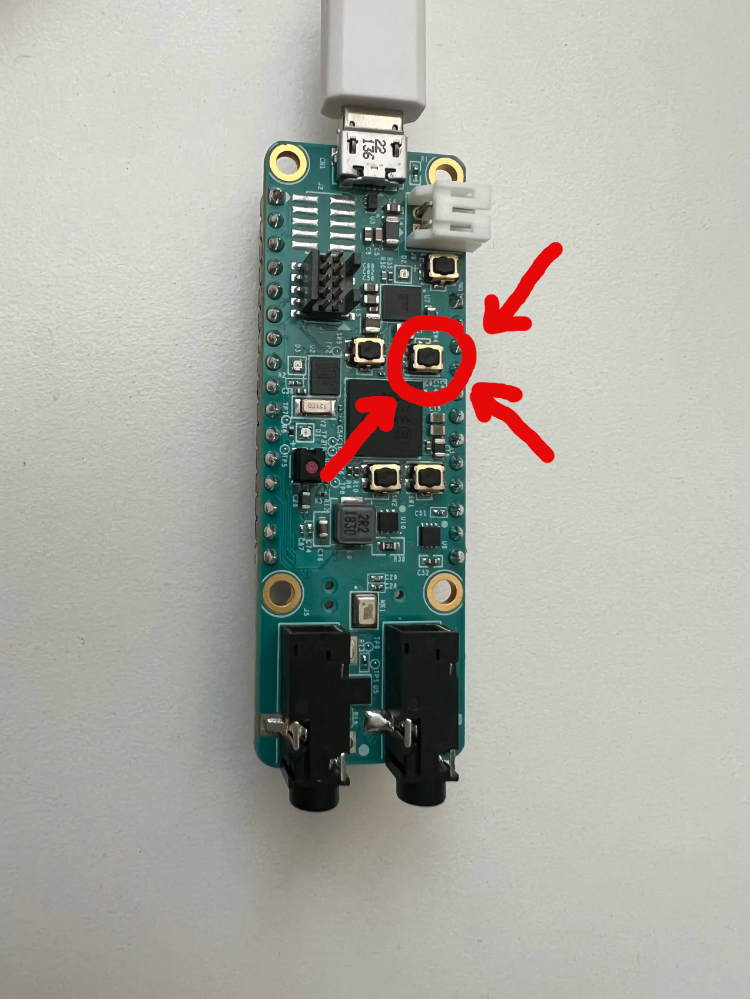

# Setup

### Windows | Install USBipd service

(download)[https://github.com/dorssel/usbipd-win/releases/download/v4.3.0/usbipd-win_4.3.0.msi]

run the exe and follow the installation wizard.

usbipd allows windows to pass usb/serial devices through to WSL, more about this later.

### Windows | Install WSL

Windows 11 | Powershell:
##
    wsl --install

Windows 10 | Powershell:
##
    wsl --install
##
    wsl --install Ubuntu

> [!NOTE]
> Windows 10 doesn't automatically Ubuntu, but Windows 11 does.

### OSX/Mac | Install brew

Follow the instructions on this page to install brew: [brew](https://brew.sh/)

### ALL | Install Git

Do this step either in a WSL shell on windows or on your main system on OSX or Linux.

OSX (Mac)
terminal\:
##
    brew install git

Linux: [visit](https://git-scm.com/download/linux)

### ALL | Install Nix

1. terminal\:
##
    bash <(curl -L https://nixos.org/nix/install) --no-daemon

2.

UNIX (OSX, Linux)\:
reboot

Windows\:
exit all wsl shells
powershell\:
##
    wsl --shutdown -d Ubuntu

3. terminal\:
##
    nix-env --install --file '<nixpkgs>' --attr nix cacert -I nixpkgs=channel:nixpkgs-19.09
> [!NOTE]
> hopefully this spring season we can use flakes and you no longer need to use version 19.09 since flakes are version independent.

### WSL/Linux | Install unzip

terminal\:
##
    sudo apt install unzip
>[!NOTE]
> Most minimalist linux distrobutions do not come with a program for decompressing zip files.
> This includes the Ubuntu WSL distrobution since zip decompression is not necessarily required for regular use.

### ALL | Clone Repository

1. Navigate to desired project home directory

2. terminal\:
##
    curl -o eCTF2024-release.zip --url "https://cdn.discordapp.com/attachments/1269857831318847599/1283570998599356426/eCTF2024-release1.zip?ex=66e81765&is=66e6c5e5&hm=efa9d0b449999092f7d0969dace8e4873796c9cf8f68d1c7d7ad45f663edf296&"

3. terminal\:
##
    unzip eCTF2024-release.zip

>[!IMPORTANT]
> This will not be the same process for obtaining the team's repository in the future this is temporary.

### ALL | First Time Environment Setup (Required everytime you clone a repo based on MITRE's 2024 eCTF repo)

1. navigate to root directory of project.

2. terminal\:
##
    nix-shell

>[!WARNING]
> The first time this is run it will take A LONG TIME, it will look like it is doing nothing, but you must leave it alone.

3. nix shell\:
##
    poetry install

# Use
Navigate to the project home directory in order to use the scripts.
All the scripts contained in this repo do not come bundled inside of mitre's.

## usbipd cheatsheet

### Unfortunately USBipd must be ran through an administrator command prompt

- List\:
##
    usbipd list
>Lists all usb devices on your device

- Bind\:
>usbipd bind -b <bus-id>
##
    usbipd bind -b 
The entry will now have the status "SHARED" if everything worked
>[!NOTE]
> The bus id is listed at the beginning of the entry of the desired device.

- Attach\:
In order to pass it through to WSL we need to attach it to our desired instance
> usbipd attach -b <busid> --wsl <wsl-instance-name>
##
    usbipd attach -b  --wsl 

The status will now be "Attached"

In Linux all devices are listed in the /dev/ directory.
The first attached device via usbipd will have the name ttyACM0
with the zero incrementing for every attached device.

Absolute path of the first device /dev/ttyACM0, this is how you will refer to it when flashing it via WSL.

## Compile

terminal\:
##
    ./compile
compiles the source code with "defaults"
>[!NOTE]
> This script will enter all the required commands to compile the source into nix and poetry for you.
> No need to enter those shells if you don't need to.

## Flash Boards

1. Hold this button to enter flash mode when reset

2. Press this button to reset

>[!IMPORTANT]
> If you did this correctly the board's blue led will be flashing continuously.

3. terminal:
##
    nix-shell
##
    poetry shell

4. run ectf update command
>ectf_update --infile <desired .img file> --port <linux device>
##
    ectf_update --infile ./build/ap.img --port /dev/ttyACM0
##
    ectf_update --infile  --port 
When the board is in flashing mode this will flash new firmware onto it.

## Functional requirement commands

>ectf_boot -a <application processor device>
##
    ectf_boot -a 
Boots the "device". Requires 2 component devices to be attached to be successful.

>ectf_list -a <application processor device>
##
    ectf_list -a 
Lists all found component boards. By default does no validation.

>ectf_attestation -a <application processor device> -p <pin> -c <component id>
##
    ectf_attestation -a  -p  -c 
Returns the attestation data of the component.

>ectf_replace -a <application processor device> -t <token> -i <in component> -o <out component>
##
    ectf_replace -a  -t  -i  -o 
replaces the desired component with a new one given a valid token.
